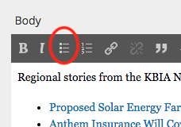

# Posting Your Newscast Online

## Overview

When you've finished posting your newscast online, you will have posted or shared the following items:

* A new audio file of your newscast.
* New web posts for every KBIA, Columbia Missourian, or Associated Press story you used which was not already on the web site.
* A "master post" with links to every story you covered today and your audio file, published on [KBIA.org](http://www.kbia.org) and attached to the "KBIA Newscast" program.
* An email to [digital@kbia.org](mailto:digital@kbia.org) that says you've posted everything online, links to the finished newscast "master post," and any photos you needed for stories, but could not find.

## Record One Last Newscast Take

Go into one of the newsroom audio booths and record one last take of your newscast, with the latest version of every story you used today. 

If you used sound bites, add them to your recording before saving the whole thing as a WAV file in `AdvReporters/Newscasts/[Time of Day]/Audio` alongside your other audio from today.


**Make sure you name your audio files consistently.** Both the WAV file and the MP3 we're about to create should be named according to a very clear convention to keep Core Publisher from getting confused.  
  
The formula for your name: `[4-digit year][2-digit month][2-digit day]NEWSCAST[AM/PM]`

For example, an MP3 for February 1, 2019 afternoon: `20190201NEWSCASTPM.mp3`


### Converting to Podcast-Ready MP3

With the WAV file you just saved open in Adobe Audition, go to the "File" menu and choose "Save As...".

In the drop-down menu for "format," choose "MP3 Audio." 

You settings should look like this. If they don't change them. 


When you're ready, click "OK" to save the file and close Adobe Audition.

## Preparing Individual Story Posts

Before you compile your final newscast post, you'll need to find or post each individual story you covered on [KBIA.org](http://www.kbia.org). We'll go over the broad strokes of handling most of this here, but for more information, you can always check the detailed guides at [Working at KBIA](http://apps.kbia.fm/workingatkbia/). 

### Looking for Existing Stories

Very often, a story will already be on our web site. For example, throughout the day, Nathan posts KBIA and Associated Press stories to the web site to make sure we're up to date, and sometimes, you'll be covering the same story in the morning someone else did the night before. This means a lot of your work may have already been done for you, and posting these stories again would be a waste of effort and make us look sloppy. 

Because of this, the first step you should always take is looking for the story on KBIA.org. You could scroll through our news feeds until you're certain it's not there, but you're much more likely to do a thorough job if you just Google it. 

To just search on KBIA's web site, add site:kbia.org to the end of your Google search. For example, here, I'm looking for a story I think may have been posted earlier today about solar energy. Take a look at how I write my search and the two places a story is likely to appear:


If you find a story this way, open it and leave that browser window or tab minimized - you'll need the story's headline and a link to it in a few minutes.

### Only Post Stories With Clean Formatting

**Never, ever, ever, ever** copy and paste directly from another web site, Microsoft Word, or Google Docs without first clearing the formatting somehow. 

We recommend using WordHTML for this purpose. You can [watch KBIA's training video on doing that here](https://apps.kbia.fm/workingatkbia/videos/05-microsoft-word-to-core-publisher/).

### KBIA's Stock Photo Library

Every story on the KBIA web site should have a photo. However, not every story will come with a photo. We do not have permission to use photos from the AP or Columbia Missourian, so those stories will need photos, and some student stories may as well. 

There's only one appropriate way to get photos for a story that does not currently have any, and that's through the KBIA stock photo library, at [kbia.smugmug.com](https://kbia.smugmug.com/). Photos there have been screened for usage rights and have credit information included on the page. If a caption is also provided, use it.


**Do not use Core Publisher's photo search.** Frequently, this will include NPR or other stock photos, which we may not have right to use.



**Do not use Flickr, Google Images, or Wikipedia to find photos.** These sites frequently have inaccurate information about the copyright or licensing status of the photos. Each photo in KBIA's stock photo library has already been screened to make sure there won't be any legal trouble.



**Do not use the watermarked photos you see on AP Newsroom.** Those are very, very expensive, and we do not have the rights to use them - that's why they're watermarked!


### Stories From Other NPR Stations

Most stories from other NPR stations in our are will automatically appear on KBIA's web site without any additional work. 


If a story is not appearing on our site, or it does not look like one has been created yet, write a headline in your "master post" for this story like you would for any other, but do not link to anything. Then, include this information in your end-of-shift email to digital@kbia.org.


### Stories From The Columbia Missourian

Out of courtesy to our partners at the Columbia Missourian, we do not post their full stories.

Instead, only post the first 3-5 paragraphs of the story, followed by a paragraph at the bottom that says "To read more on this story, visit our partners at the Columbia Missourian." and links directly to the original article. 


**Post 3-5 paragraphs from the original Missourian story.** Do not post text from any version of the story you may have created for your use on-air. 



**Do not copy and paste directly into Core Publisher from the Missourian's web site.** Use WordHTML to clean your formatting, as described in the section above.


The byline for a Missourian story should contain two names: the story author and "Columbia Missourian.

Like all stories KBIA posts, the headlines should be formatted with capital letters to match NPR's internal style.

We don't necessarily have rights to the Missourian's photos, so you'll have to use photos from the KBIA stock photo library instead. 

Here's an example of how that should look inside Core Publisher's post editor.


And here's what the final story looked like:


### Stories From The Associated Press

Post the full version of the AP story you used in your newscast. Do not use any shortened or radio-friendly versions you may have created.

The byline on Associated Press stories should always say just "Associated Press." When AP says a story was originally from a certain newspaper or cites an outlet in their reporting, that does not mean you should include them in the byline

Like all stories KBIA posts, the headlines should be formatted with capital letters to match NPR's internal style.


**Do not copy and paste directly into Core Publisher from AP Newsroom.** Use WordHTML to clean your formatting, as described in the section above.


Some other things you'll need to do to an AP story:

* Add a photo from the KBIA stock photo library. If there is not one that fits the topic and tone of the story, include that in your end-of-shift email.
* Remove the line at the beginning of the story that says "COLUMBIA -" or whatever. We do not use those.

### Stories From KBIA

KBIA's professional staff members post their own stories to the web site, so you should be able to find them in your first step. 

If you are posting a student story, it should be in the same folder you found your script, along with any supporting documents. Include the student's full name on the byline. 

Like all stories KBIA posts, the headlines should be formatted with capital letters to match NPR's internal style.

If the student did not provide a photo along with caption and credit information, you'll need to add one from the KBIA stock photo library. If there is not one that fits the topic and tone of the story, include that in your end-of-shift email.


**Do not copy and paste directly into Core Publisher from Microsoft Word or Google Docs.** Use WordHTML to clean your formatting, as described in the section above.


## Creating Your Master Newscast Post

This is the easiest part of your day. All you have to do is follow a formula.

Headline: `[Morning/Afternoon] Newscast for [Full Month Name] [Date], [Full Year]`

Author: `You`

Category: `News`

Slug: `News`

Content:

```text
Regional stories from the KBIA Newsroom, including:

[A bulleted list of all the stories you covered today, linked to their articles on KBIA.org]
- Charles Foster Kane, American News Magnate, Dead at 70
- Clarice Starling Receives Federal Bureau of Investigation's Highest Honor

[Insert your audio file here]
```

To add that bulleted list, click the button that looks like a series of dots and lines:


**Do not try to copy and paste headlines from other parts of Core Publisher.** If you do, you'll get very weird formatting. It's much easier just to type them in again yourself.




After you've typed in the headlines, you can go back and add the links. Select each headline, then use the little chain icon for that part:


Click the "Audio" button on that same toolbar when you're ready to insert your audio. You don't need to include anything in the description field:


Now, let's make sure this all appears as one unit on the home page on KBIA. to do that, position your cursor at the very bottom of the story, then click the button that looks like a dotted line through a bunch of text:


A little dotted line will appear with the red word "break" underneath it.

Once you've finished with this, go into the "Related Programs" tab underneath your editing box and add KBIA Newscast. You'll know you did it right when the "NID" number appears:


At the bottom of the screen, where it asks if you want to send the program through the NPR API, NPR One or the PMP, say yes to all of these. **Do not** say you want to send this post to NPR.org. 


**Make sure you have NPR One set up correctly.** In the NPR One expiration area, tell morning newscasts to expire on the same day they are posted at 1:00 p.m. and afternoon newscasts to expire the same day they were posted at 11:59 p.m. If you don't do this right, there will be trouble!!


Click publish, and you should be good to go!

## End-of-Shift Email

Once you've finished all your work, you need to send me an email so I know. That email should include a link to your newscast post, information about any NPR station posts you were unable to find, questions about anything that may have gone wrong, and a list of any photos you needed, but could not find. 

Send this to [digital@kbia.org](mailto:digital@kbia.org).

Then you're finished! Thank you!

